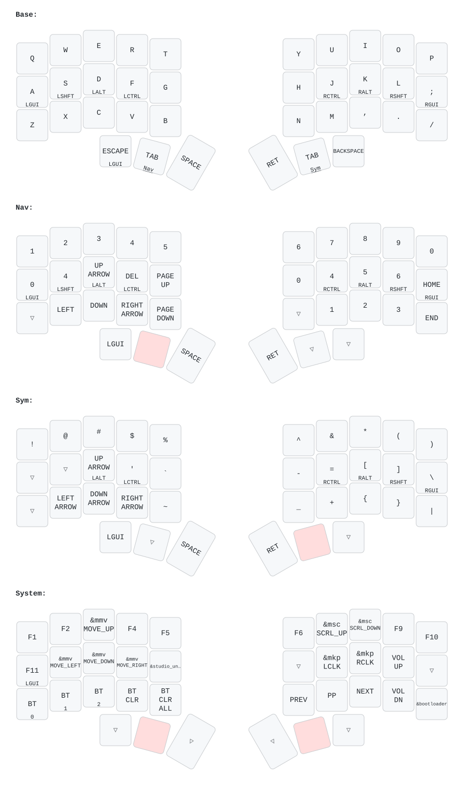
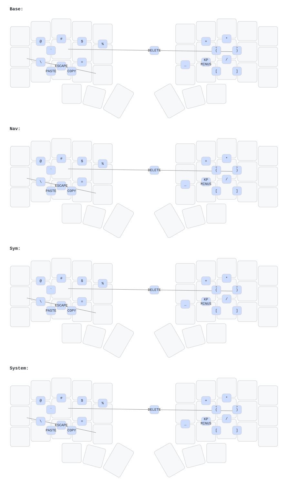

# zmk-corne-mini

Personal ZMK config for my Corne Mini.

This started from the KeyboardHoarders Corne config and has been customized around home-row mods, thumb-accessed nav/symbol layers, a conditional system layer, and built-in mouse controls.

## Layout

The layout image below is generated directly from [`config/corne.keymap`](./config/corne.keymap), so it stays in sync with the firmware source.



PNG exports are generated alongside the SVGs for host-side preview tools:

- [`assets/corne.keymap.png`](assets/corne.keymap.png)
- [`assets/corne.combos.png`](assets/corne.combos.png)

## Combos



Notable combos in the current layout:

- `Esc` and `Delete`
- symbol combos for `` ` @ # $ % \ / * + - _ [ ] < > ``
- `Copy` and `Paste`

## Layers

- `Base`: alpha layer with home-row mods
- `Nav`: numbers, arrows, paging, and navigation
- `Sym`: symbols and brackets
- `System`: Bluetooth profile controls, bootloader, mouse movement, scroll, and clicks

`System` is activated as a conditional layer when both `Nav` and `Sym` are held.

## Mouse Keys

Mouse movement and scroll are tuned in [`config/corne.keymap`](./config/corne.keymap):

- movement max speed: `ZMK_POINTING_DEFAULT_MOVE_VAL 1200`
- scroll max speed: `ZMK_POINTING_DEFAULT_SCRL_VAL 16`
- movement acceleration: `450ms` to max speed, exponent `2`
- scroll acceleration: `300ms` to max speed, exponent `1`

On the `Nav` layer, the far-right key on the right half is:

```text
Home
End
```

`Home` and `End` send the proper document top/bottom navigation keycodes for browser and app content. The `System` layer keeps the original `F6` / `F9` positions around the scroll keys.

## Keymap Popup

This machine's Hammerspoon config binds `Ctrl+Option+Cmd+K` to a brief Corne Mini keymap popup. The popup shows the generated keymap and combo PNGs from this repo and auto-hides after 12 seconds. Press the hotkey again while it is visible to close it immediately.

## Bluetooth And ZMK Studio

To manage Bluetooth profiles or connect through ZMK Studio:

1. Plug the left half into your computer over USB.
2. Open `https://zmk.studio`.
3. Connect to the board when it appears.
4. Use the `System` layer for `BT_SEL 0`, `BT_SEL 1`, `BT_SEL 2`, `BT_CLR`, and `BT_CLR_ALL`.
5. Use the `studio_unlock` key on the `System` layer if Studio asks for it.

## Regenerating The Diagrams

```bash
./scripts/render-diagrams.rb
```

The script always regenerates the YAML and SVGs. If `rsvg-convert` is installed, it also exports PNGs for the Hammerspoon popup.

The firmware keymap still uses the standard 42-position Corne transform with six
transparent placeholders for the missing outer column. The script trims those
non-physical positions, redraws the diagrams as a true 3x5+3 Corne Mini, and
keeps combos in the separate combo diagram instead of overlaying them on the
main layout SVG.
